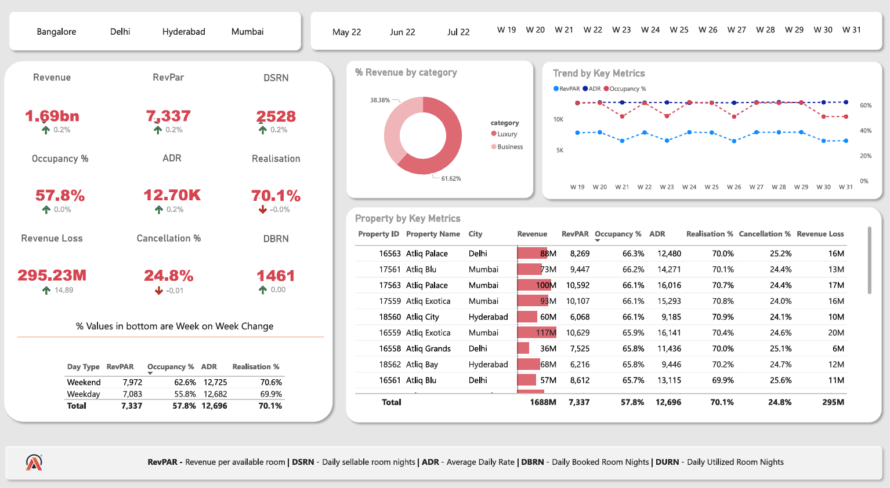
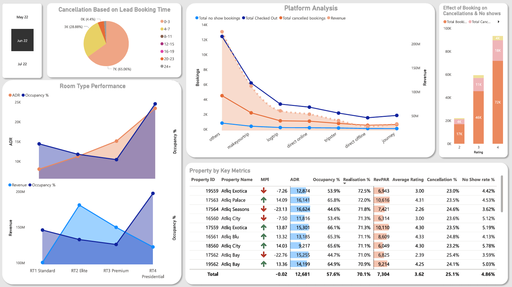

### 🔗 **[📄 Full Report – View on Google Drive](https://drive.google.com/file/d/1njXip2nhrUlpWKMZIY86b9GyjK3lUeV3/view?usp=sharing)**

---

# 📊 Hospitality Business Intelligence Dashboard  
**Optimizing Hotel Performance with Power BI | Pricing Strategy, Occupancy Analysis, Booking Trends**

<h3>Dashboard - Summary View (Level 1)</h3>


<h3>Dashboard - Room Type / Channel Breakdown (Level 2)</h3>



---

## 📌 Project Objective

As a hotel chain owner looking to **evaluate hotel performance**, we built a data-driven dashboard using **Power BI** to identify bottlenecks in pricing, occupancy, platform usage, and customer experience. The goal is to enable **Level 1 (Detection)** and **Level 2 (Diagnosis)** decision-making for:

- Acquiring new hotels
- Optimizing existing operations
- Strategizing dynamic pricing

---

## 📁 Dataset Sources

- **dim_date** – calendar info with day types, week numbers
- **dim_hotels** – Hotels Name, property_id, city
- **dim_rooms** – Room Category
- **fact_bookings** – raw transactional booking data  
- **fact_aggregated_bookings** – daily successful bookings & room capacity
  
---

## 📈 Key KPIs Included

| KPI                        | Formula / Logic                                                                 |
|---------------------------|----------------------------------------------------------------------------------|
| Occupancy Rate            | `(Successful Bookings / Room Capacity) * 100`                                   |
| ADR (Average Daily Rate)  | `Revenue Realized / Successful Bookings`                                        |
| RevPAR                    | `Revenue Realized / Room Capacity`                                              |
| Market Penetration Index  | `Hotel Occupancy / Market Avg Occupancy * 100`                                  |
| Booking Lead Time         | `Check-in Date - Booking Date`                                                  |
| Ratings by Room Type      | `Average Ratings for RT1 - RT4`                                                 |
| Revenue Lost (Cancellations) | `Sum of (Revenue Generated - Revenue Realized) for Cancellations`           |

---

## ❓ Business Questions Solved

### 📍 Acquisition Analysis
- Which hotels have the **lowest occupancy**?
- What is their **RevPAR trend** over time?
- Is their **pricing strategy aligned** with demand?

### 📍 Customer Experience
- Which room types receive **lower ratings**?
- Do **low ratings correlate with higher cancellation/no-show**?

### 📍 Channel Strategy
- Which platforms have **highest cancellation rates**?
- Are **OTA commissions hurting revenue realization**?

---

## 🎯 Strategic Insights & Solutions

- **Dynamic Pricing Implementation** using demand trends
- **Early-bird discounts** for long lead-time bookings
- **Non-refundable rates** for reducing cancellation losses
- **Optimized room mix strategy** based on ADR & Ratings

---

## 🧠 Power BI Model Structure

- **Star Schema** using fact tables (bookings, capacity) at center  
- **DAX Measures** – Custom logic for ADR, RevPAR, % Change, etc.  
- **Applied Steps in Power Query** for cleaning and shaping data  

---

## 💻 Code Snippet (DAX Examples)

```DAX
-- Occupancy Rate
Occupancy Rate (%) = 
DIVIDE(SUM(fact_aggregated_bookings[successful_bookings]), SUM(fact_aggregated_bookings[capacity])) * 100

-- RevPAR
RevPAR = 
DIVIDE(SUM(fact_bookings[revenue_realized]), SUM(fact_aggregated_bookings[capacity]))

-- Booking Lead Time
Booking Lead Time = 
DATEDIFF(fact_bookings[booking_date], fact_bookings[check_in_date], DAY)

-- Realization Rate
Realization Rate = 
DIVIDE(SUM(fact_bookings[revenue_realized]), SUM(fact_bookings[revenue_generated]))
```

---

## 🛠 Tools Used

- Power BI (Data modeling, DAX, Data Viz)
- Microsoft Excel (Initial EDA)

---

## 📬 Contact

If you're interested in expanding this model or customizing it for your chain, feel free to reach out:

**Darshan Dugar** – Data Analyst & ML Enthusiast  
📧 Email: [darshan.dugar05@gmail.com]  
🌐 LinkedIn: [(https://www.linkedin.com/in/darshan-dugar2004/)]
